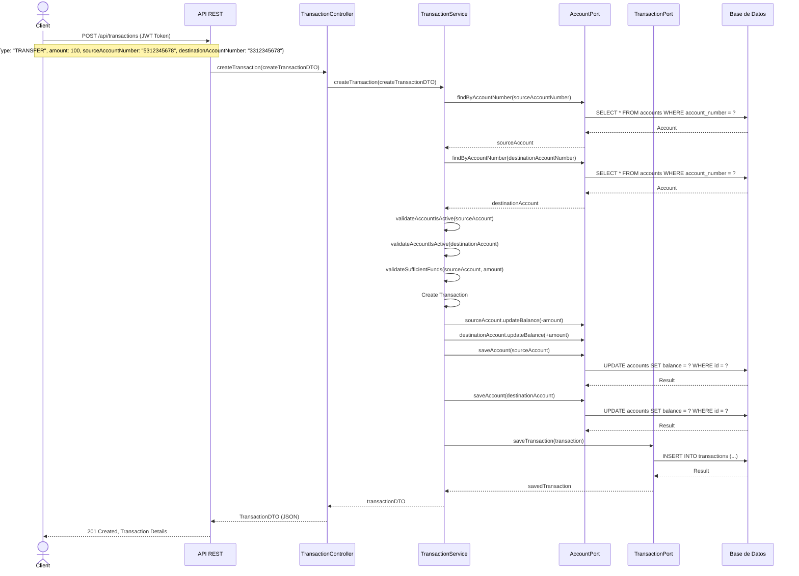
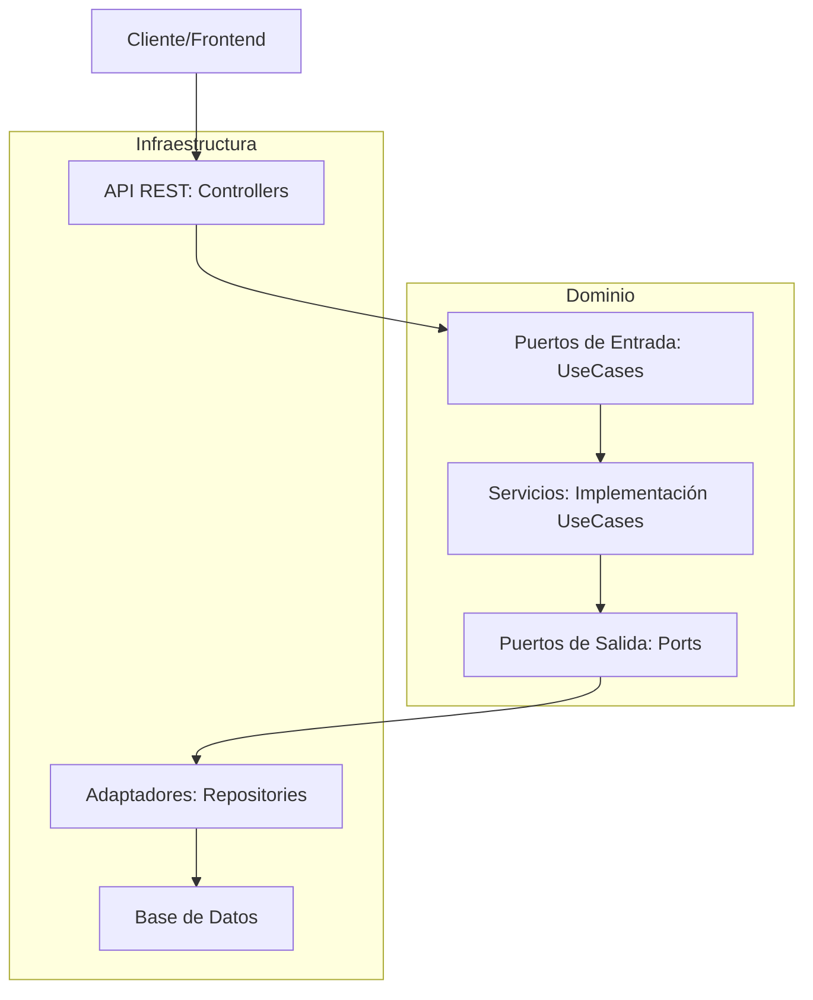

# Sistema Financiero Bancario - API REST

## Descripción General

Aplicación bancaria desarrollada para ser utilizada por trabajadores de una entidad financiera. Permite la administración completa de clientes, productos financieros y transacciones a través de una API REST, implementada con arquitectura hexagonal para garantizar mantenibilidad y escalabilidad.

## Índice

- [Tecnologías Utilizadas](#tecnologías-utilizadas)
- [Arquitectura Hexagonal](#arquitectura-hexagonal)
- [Estructura del Proyecto](#estructura-del-proyecto)
- [Capas de la Aplicación](#capas-de-la-aplicación)
- [Configuración del Proyecto](#configuración-del-proyecto)
- [Seguridad JWT](#seguridad-jwt)
- [Códigos HTTP](#códigos-http)
- [Funcionalidades](#funcionalidades)
- [Pruebas con Postman](#pruebas-con-postman)
- [Diagramas](#diagramas)
- [Contribuciones](#contribuciones)

## Tecnologías Utilizadas

- **Java 21**: Lenguaje de programación principal
- **Spring Boot**: Framework de desarrollo
- **Spring Data JPA**: Para la persistencia de datos
- **Spring Security**: Para la seguridad de la aplicación
- **PostgreSQL**: Base de datos relacional
- **Docker**: Para la contenerización de la aplicación
- **JUnit 5**: Para pruebas unitarias
- **Mockito**: Para pruebas con mocks
- **JWT**: Para autenticación basada en tokens

## Arquitectura Hexagonal

### ¿Qué es la Arquitectura Hexagonal?

**Definición**: Patrón arquitectónico que separa la lógica de negocio de los detalles técnicos mediante puertos y adaptadores.

**Responsabilidad**: Permitir que la aplicación sea fácilmente testeable, mantenible y adaptable a cambios.

**Regla**: El dominio no debe depender de ninguna tecnología externa.

### Conceptos Clave

- **Dominio**: El núcleo de la aplicación con sus reglas de negocio
- **Puertos**: Interfaces que definen cómo el dominio interactúa con el exterior
- **Adaptadores**: Implementaciones concretas de los puertos para tecnologías específicas

### ¿Por qué usar Arquitectura Hexagonal?

- Mejora la organización y mantenibilidad del código
- Permite la reutilización en diferentes componentes
- Facilita el testing y la documentación automática
- Sigue el principio de responsabilidad única
- Permite cambiar fácilmente las tecnologías externas

## Estructura del Proyecto

```
src/main/java/com/bank
├── application          # Casos de uso/servicios y DTOs
│   ├── dto              # DTOs para representación externa
│   ├── mapper           # Mappers entre entidades y DTOs
│   └── service          # Implementación de casos de uso
├── domain               # Entidades de dominio y puertos
│   ├── exception        # Excepciones de dominio
│   ├── model            # Entidades de dominio
│   │   └── enums        # Enumeraciones
│   └── port             # Interfaces (puertos)
│       ├── in           # Puertos de entrada
│       └── out          # Puertos de salida
├── infrastructure       # Adaptadores
│   ├── config           # Configuración
│   ├── persistence      # Adaptadores de repositorio
│   │   └── adapter      # Implementaciones de puertos de salida
│   ├── rest             # Controladores REST
│   ├── security         # Configuración de seguridad
│   └── util             # Utilidades
└── BankApplication.java # Punto de entrada
```

## Capas de la Aplicación

### 4.1 Capa de Dominio - El Corazón del Sistema

**Definición**: Contiene las entidades principales y las reglas de negocio esenciales.

**Responsabilidad**: Definir los conceptos centrales del sistema bancario y sus relaciones.

**Entidades principales**:
- `Customer`: Representa a un cliente de la entidad financiera
- `Account`: Representa una cuenta bancaria (ahorro o corriente)
- `Transaction`: Representa una operación financiera

### 4.2 Capa de Aplicación - Los Casos de Uso

**Definición**: Implementa la lógica de negocio usando las entidades del dominio.

**Responsabilidad**: Orquestar las operaciones del sistema y aplicar las reglas de negocio.

**Componentes clave**:
- **DTOs**: Objetos para transferencia de datos entre capas
- **Mappers**: Conversores entre entidades y DTOs
- **Services**: Implementación de los casos de uso

### 4.3 Capa de Infraestructura - La Conexión al Mundo Exterior

**Definición**: Implementa los adaptadores para interactuar con sistemas externos.

**Responsabilidad**: Conectar la aplicación con bases de datos, APIs y servicios externos.

**Adaptadores principales**:
- **REST Controllers**: Exponen los endpoints de la API
- **Repositories**: Implementan la persistencia de datos
- **Security Config**: Configuración de autenticación y autorización

## DTOs (Data Transfer Objects)

### ¿Qué son los DTOs?

**Definición**: Objetos simples que transportan datos entre capas de la aplicación.


### ¿Por qué en archivos separados?

- Mejora la organización y mantenibilidad del código
- Permite la reutilización en diferentes componentes
- Facilita el testing y la documentación automática
- Sigue el principio de responsabilidad única

## Configuración del Proyecto

### Requisitos Previos

- Java 21
- Maven
- Docker (opcional, para ejecutar PostgreSQL)

### Base de Datos con Docker

```yaml
services:
  db:
    image: postgres:17-alpine
    container_name: bank-db
    ports:
      - "5432:5432"
    environment:
      - POSTGRES_DB=bankdb
      - POSTGRES_USER=postgres
      - POSTGRES_PASSWORD=postgres
```

### Configuración de Spring Boot

```yaml
server:
  port: 8080

spring:
  application:
    name: bank-application
  
  datasource:
    url: jdbc:postgresql://localhost:5432/bankdb
    username: postgres
    password: postgres
    driver-class-name: org.postgresql.Driver
  
  jpa:
    hibernate:
      ddl-auto: update
    show-sql: true
    properties:
      hibernate:
        format_sql: true
        dialect: org.hibernate.dialect.PostgreSQLDialect

# Configuración de logging
logging:
  level:
    root: INFO
    com.bank: DEBUG
    org.springframework.web: INFO
    org.hibernate: INFO
  file:
    name: logs/bank-application.log
  pattern:
    file: "%d{yyyy-MM-dd HH:mm:ss} [%thread] %-5level %logger{36} - %msg%n"
    console: "%d{yyyy-MM-dd HH:mm:ss} [%thread] %-5level %logger{36} - %msg%n"

# Configuración de seguridad JWT
app:
  security:
    jwt:
      secret: {tu-clave}
      expiration: 86400000  # 24 horas en milisegundos
```

### Ejecución del Proyecto

```bash
# Iniciar base de datos
docker-compose up -d

# Compilar el proyecto
mvn clean install

# Ejecutar la aplicación
mvn spring-boot:run
```

## Seguridad JWT

### ¿Qué es JWT?

**Definición**: Sistema de autenticación basado en tokens que no requiere estado en el servidor.

**Responsabilidad**: Proteger los endpoints de la API contra accesos no autorizados.

### Flujo de Autenticación

1. El usuario envía credenciales al endpoint `/api/auth/login`
2. El sistema verifica las credenciales y genera un token JWT
3. El cliente incluye el token en el header `Authorization: Bearer {token}`
4. El sistema valida el token antes de permitir el acceso

### Configuración de Seguridad

```java
http
    .csrf(csrf -> csrf.disable())
    .sessionManagement(session -> session
        .sessionCreationPolicy(SessionCreationPolicy.STATELESS)
    )
    .authorizeHttpRequests(auth -> auth
        .requestMatchers("/api/auth/**").permitAll()
        .requestMatchers("/swagger-ui/**", "/v3/api-docs/**").permitAll()
        .anyRequest().authenticated()
    )
    .addFilterBefore(new JwtAuthenticationFilter(jwtTokenProvider), 
            UsernamePasswordAuthenticationFilter.class);
```

## Códigos HTTP

### Códigos de Éxito
- **201 Created**: Cuando creas algo nuevo
- **200 OK**: Cuando actualizas algo existente y devuelves datos
- **204 No Content**: Cuando actualizas pero no devuelves datos

### Códigos de Error
- **400 Bad Request**: Cuando la petición tiene errores de validación
- **401 Unauthorized**: Cuando no hay autenticación
- **403 Forbidden**: Cuando no hay autorización
- **404 Not Found**: Cuando no encuentras lo que buscan
- **409 Conflict**: Cuando hay conflictos (ej. eliminar cliente con cuentas)

## Funcionalidades

### Gestión de Clientes

#### Endpoints
- `POST /api/customers` - Crear cliente
- `PUT /api/customers/{id}` - Actualizar cliente
- `DELETE /api/customers/{id}` - Eliminar cliente
- `GET /api/customers/{id}` - Obtener cliente por ID
- `GET /api/customers` - Listar todos los clientes

#### Reglas de Negocio
- Un cliente debe ser mayor de edad
- No se puede eliminar un cliente con productos vinculados
- Email debe ser válido y único
- Nombres y apellidos deben tener al menos 2 caracteres

### Gestión de Cuentas

#### Endpoints
- `POST /api/accounts/customers/{customerId}` - Crear cuenta
- `PATCH /api/accounts/{id}/status` - Cambiar estado de cuenta
- `DELETE /api/accounts/{id}` - Cancelar cuenta
- `GET /api/accounts/{id}` - Obtener cuenta por ID
- `GET /api/accounts/number/{accountNumber}` - Obtener cuenta por número
- `GET /api/accounts/customers/{customerId}` - Listar cuentas de un cliente

#### Reglas de Negocio
- Solo se permiten cuentas de ahorro o corriente
- Las cuentas deben estar vinculadas a un cliente
- Las cuentas de ahorro no pueden tener saldo negativo
- Solo se pueden cancelar cuentas con saldo cero
- Los números de cuenta deben ser únicos y generados automáticamente
- Cuentas de ahorro inician con "53" y corrientes con "33"

### Gestión de Transacciones

#### Endpoints
- `POST /api/transactions` - Realizar transacción
- `GET /api/transactions/{id}` - Obtener transacción por ID
- `GET /api/transactions/accounts/{accountNumber}` - Listar transacciones de una cuenta

#### Tipos de Transacciones
- **Depósito**: Ingreso de fondos a una cuenta
- **Retiro**: Extracción de fondos de una cuenta
- **Transferencia**: Movimiento entre cuentas

#### Reglas de Negocio
- Solo se permiten cuentas activas para transacciones
- Las cuentas deben tener fondos suficientes para retiros
- Las transferencias actualizan saldo en ambas cuentas

## Pruebas con Postman

Se ha creado una colección completa de Postman para probar todos los endpoints de la API:

### Configuración
1. Descarga el archivo `bank-api-tests.json`
2. Importa la colección en Postman
3. Configura la variable de entorno `baseUrl` (default: `http://localhost:8080`)
4. Ejecuta las pruebas en el orden sugerido

### Pruebas Incluidas
- **Autenticación**: Login y validación de tokens
- **CRUD de clientes**: Operaciones completas de clientes
- **Operaciones de cuentas**: Creación y gestión de cuentas
- **Transacciones financieras**: Depósitos, retiros y transferencias
- **Escenarios de error**: Validación de errores y excepciones

## Diagramas

### Diagrama de Secuencia para Transferencia



### Diagrama de Componentes de la Arquitectura Hexagonal



## Conclusión

Este proyecto implementa un **sistema bancario completo** siguiendo las mejores prácticas de arquitectura y desarrollo. La **arquitectura hexagonal** permite una clara separación de responsabilidades, facilitando el mantenimiento y la evolución del sistema.

### Características Principales

- **Arquitectura sólida** con separación clara de responsabilidades
- **Seguridad robusta** con autenticación JWT
- **API REST completa** con todos los códigos HTTP apropiados
- **Documentación exhaustiva** con diagramas y ejemplos
- **Pruebas automatizadas** con colección Postman completa
